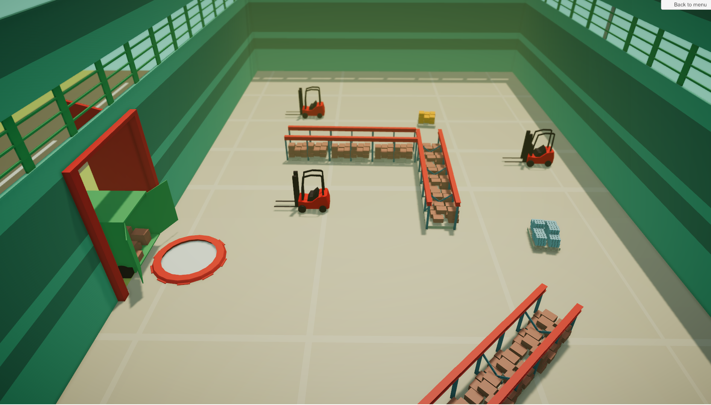

# UnityFactory
 
Tutorial for handling of different scenes and usage of data persistence

https://learn.unity.com/mission/programming-systems-and-architecture?uv=2020.3&pathwayId=5f7e17e1edbc2a5ec21a20af

